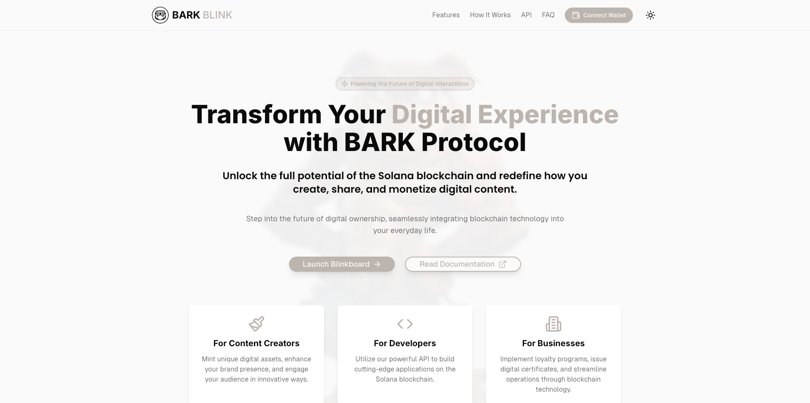
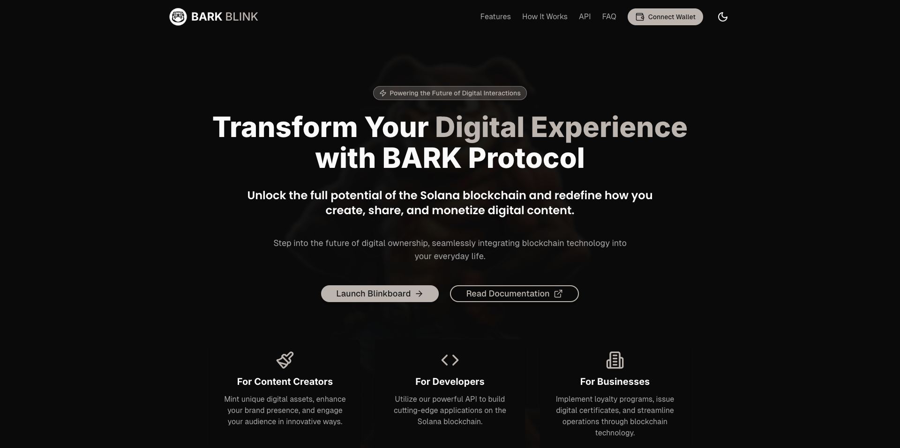
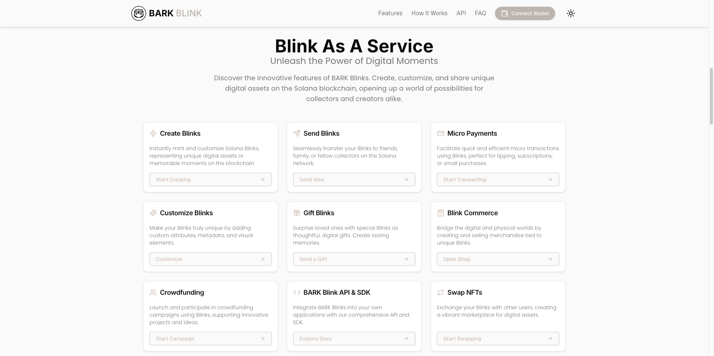

# BARK - BLINK As A Service Application

Welcome to the **BARK - BLINKS** project! This repository hosts the frontend code for the BARK Protocol’s **Blinks As A Service** platform, built with Next.js, React, and Tailwind CSS. It provides an intuitive web interface for creating, managing, and trading digital assets—Blinks—on the Solana blockchain.

## Table of Contents

- [Overview](#overview)
- [Features](#features)
- [Blinkboard (Dashboard)](#blinkboard)
- [Web Interface and Logic](#web-interface-and-logic)
- [Screenshots](#screenshots)
- [Getting Started](#getting-started)
- [Project Structure](#project-structure)
- [Technologies Used](#technologies-used)
- [Contributing](#contributing)
- [License](#license)
- [Contact](#contact)

## Overview

BARK Blink is a decentralized application (dApp) designed for the seamless management of digital assets (Blinks) on Solana. It simplifies the creation, transfer, and trade of these assets, allowing users to effortlessly manage NFTs, SPL tokens, airdrops, and wallet-to-wallet transactions. Built on Solana's scalable infrastructure, BARK Blink offers a streamlined experience for users to participate in the evolving landscape of digital asset management.

## Features

- **Blink Generator**: Easily create and customize Blinks with unique attributes.
- **Blink Management**: Organize your Blink collection with a user-friendly dashboard.
- **Market Integration**: Trade Blinks on supported marketplaces.
- **Token Swapping**: Manage assets efficiently with integrated swapping.
- **Secure Wallet Connection**: Supports Phantom, Solflare, and Backpack wallets for secure transactions.
- **Real-Time Notifications**: Stay updated on transactions and activity.
- **Analytics and Portfolio Tracking**: Monitor your Blink portfolio with comprehensive insights.
- **Social Sharing**: Showcase and share your Blinks across platforms.

## Blinkboard (Dashboard)

The **Blinkboard** serves as the central hub of the BARK - BLINKS application, providing a comprehensive interface to manage your Blinks and related activities.

**Key features include:**

- Real-time portfolio tracking and Blink valuation.
- Creation and customization of unique NFTs.
- Detailed transaction history and analytics.
- Marketplace integration for seamless Blink trading.
- Staking and reward management to maximize asset value.
- Personalized user profiles with settings customization.
- Social interactions and notifications for important updates.

Explore the **Blinkboard** at [Blinkboard GitHub](https://github.com/barkprotocol/blinkboard) for a streamlined asset management experience, whether you're a casual user or an advanced trader.

## Web Interface and Logic

The BARK - BLINKS web interface is built using **Next.js** and **React**, designed for responsive user interactions. **Tailwind CSS** powers the UI for rapid, modern development. Here are some of the key components:

- **Wallet Integration**: Securely connect via Solana wallets (Phantom, Solflare, Backpack) using `@solana/wallet-adapter-react`.
- **API Communication**: The interface interacts with the backend through REST APIs for Blink creation, transfer, and marketplace activities.
- **On-Chain Operations**: Utilize `@solana/web3.js` to create SPL tokens, mint NFTs, and perform transactions.
- **State Management**: Leverages React hooks and context for wallet connections, session management, and real-time updates across Blinkboard.
- **Analytics and Notifications**: Track portfolio performance and stay updated on transactions.

## Screenshots

### Landing Page & Hero Section
  


### Features


### How It Works


### Call to Action


### FAQ


### Newsletter


## Getting Started

To get started with the BARK - BLINKS web app, follow these steps:

### Prerequisites

- Node.js (v18 or later)
- pnpm or yarn
- Solana CLI (for local development)

### Installation

1. Clone the repository:
   ```bash
   git clone https://github.com/barkprotocol/blinks-as-a-service-dapp.git
   ```

2. Install dependencies:
   ```bash
   pnpm install
   ```
   or
   ```bash
   yarn install
   ```

3. Configure environment variables:  
   Create a `.env.local` file in the root directory and add the necessary variables:
   ```bash
   NEXT_PUBLIC_RPC_ENDPOINT=your_solana_rpc_endpoint
   NEXT_PUBLIC_NETWORK=mainnet-beta
   ```

4. Run the development server:
   ```bash
   pnpm run dev
   ```
   or
   ```bash
   yarn dev
   ```

5. Open [http://localhost:3000](http://localhost:3000) in your browser.

## Usage

1. Connect your Solana wallet.
2. Create and customize your Blinks through the intuitive UI.
3. Send Blinks to others or trade them on supported marketplaces.
4. Manage and track your Blinks via Blinkboard.
5. Swap tokens using the decentralized exchange functionality.

## Prisma

1. Update your `schema.prisma` file with the latest schema.
2. Run `npx prisma generate` to refresh the Prisma client.
3. Run `npx prisma db push` to apply the schema changes.

## API Routes (under construction)

- `/api/v1/create-blink`: Create a new Solana Blink.
- `/api/v1/send-blink`: Transfer a Blink to another user.
- `/api/v1/get-user-blinks`: Retrieve a user's Blink collection.
- `/api/v1/create-spl-token`: Create a new SPL token.
- `/api/v1/swap-tokens`: Swap tokens on Solana.

Check the API documentation for more details.

## Contributing

We welcome contributions to BARK Blink! To contribute:

1. Fork the repository.
2. Create a new branch (`git checkout -b feature/NewFeature`).
3. Make your changes.
4. Commit your changes (`git commit -m 'Add NewFeature'`).
5. Push to your branch (`git push origin feature/NewFeature`).
6. Open a Pull Request.

Please ensure tests are updated as needed and follow the [Contributor Covenant](https://www.contributor-covenant.org/) code of conduct.

## License

This project is licensed under the MIT License. See the [LICENSE](LICENSE) file for details.

## Acknowledgements

- [Solana](https://solana.com/)
- [Next.js](https://nextjs.org/)
- [React](https://reactjs.org/)
- [Tailwind CSS](https://tailwindcss.com/)
- [@solana/web3.js](https://github.com/solana-labs/solana-web3.js)
- [Anchor Framework](https://www.anchor-lang.com/)
